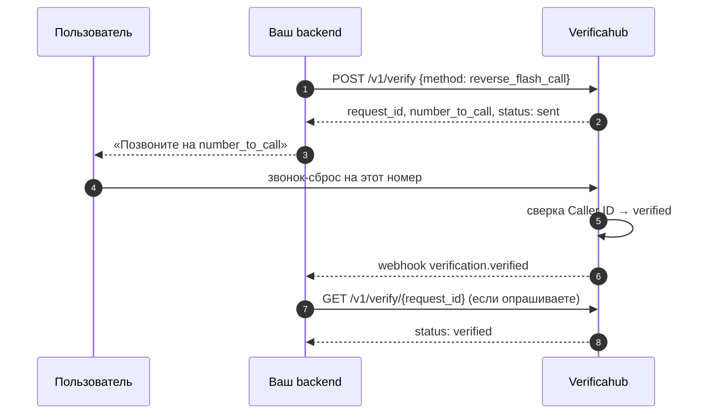
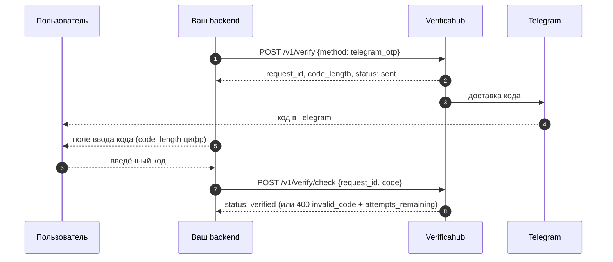
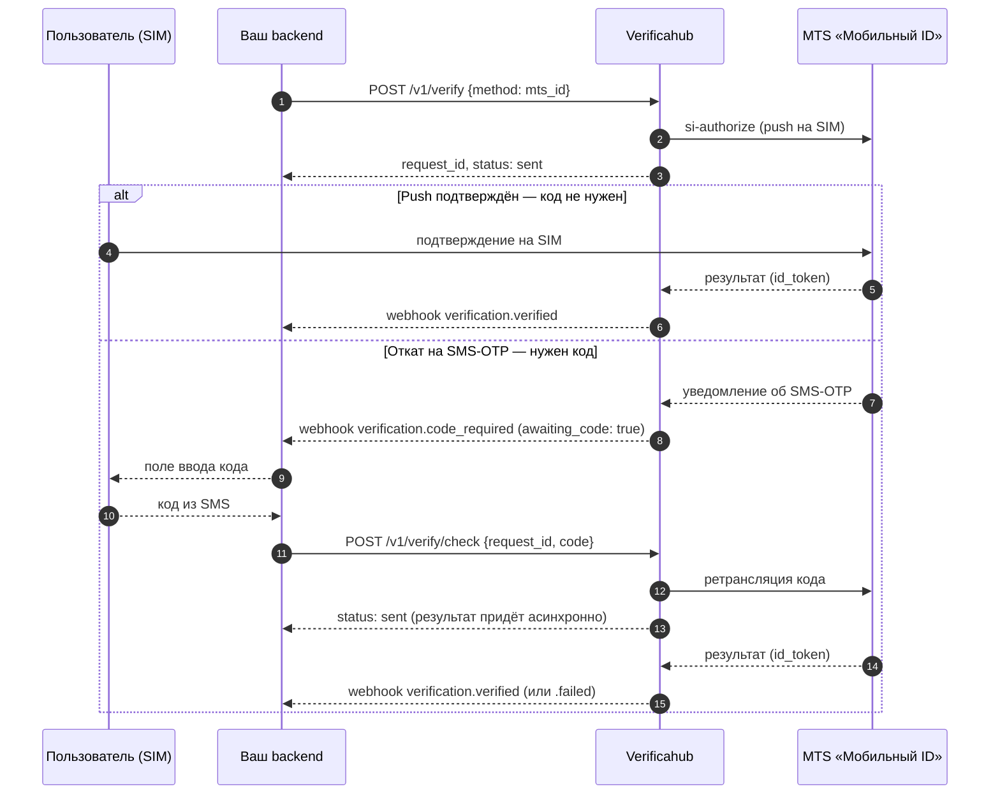

# Как работают потоки подтверждения

Ниже — что происходит на каждом шаге, с точки зрения вашего бэкенда. Общая схема одна:
`POST /v1/verify` создаёт сессию, а результат вы узнаёте либо по [вебхуку](./webhooks.md), либо
опрашивая `GET /v1/verify/{request_id}`. Отличается только середина — то, как пользователь проходит
подтверждение.

Статусы сессии: `sent` → `delivered` (необязательный) → `verified`, либо `expired` (истёк TTL) /
`failed` (терминальная ошибка).

## reverse_flash_call — без ввода кода

Пользователь сам звонит на выданный номер, мы подтверждаем по Caller ID. Код никто не вводит.

Покажите пользователю `number_to_call`, а сами ждите `verified` (по вебхуку или опросом). Вводить код
не нужно, `/v1/verify/check` для этого метода не используется.

## telegram_otp — код из Telegram

Мы генерируем код и доставляем его в Telegram официальным ботом; пользователь вводит код у вас,
вы отправляете его на проверку.

При неверном коде ответ `400 invalid_code` содержит `attempts_remaining`; после исчерпания попыток
сессия переходит в `failed`.

## mts_id — подтверждение через оператора (двойной путь)

Ключевая особенность: у `mts_id` **два пути**, и заранее не известно, какой сработает. Обычно оператор
присылает подтверждение прямо на SIM — и код не нужен. Но если push не проходит (например, номер MVNO),
происходит **откат на SMS-OTP**, и вот тогда пользователю приходит код, который нужно ввести.

Поэтому **не показывайте поле ввода кода сразу**. Ждите сигнала: вебхук `verification.code_required`
или флаг `awaiting_code: true` в статусе. Нет сигнала — кода не будет.

Что важно учесть для `mts_id`:

- **Опрашивайте `awaiting_code`** (или слушайте `verification.code_required`) — только по этому сигналу
  показывайте ввод кода. До него `awaiting_code: false`.
- **`/v1/verify/check` асинхронный.** Мы ретранслируем код оператору, а окончательный результат
  приходит чуть позже. Поэтому ответ на `check` — `status: sent`, а не `verified`. Итог узнавайте по
  `GET /v1/verify/{request_id}` или вебхукам `verification.verified` / `verification.failed`.
- **Слишком ранний код** (до отката) вернёт `409 not_pending`.

## Узнать результат: вебхук или опрос

Оба способа рабочие, и их можно комбинировать (вебхук как основной, опрос — как страховка):

- **Вебхук** — мы сами присылаем событие на ваш URL (см. [Вебхуки](./webhooks.md)).
- **Опрос** — периодически запрашивайте `GET /v1/verify/{request_id}` до терминального статуса.

Источник истины при расхождениях — `GET /v1/verify/{request_id}`.
