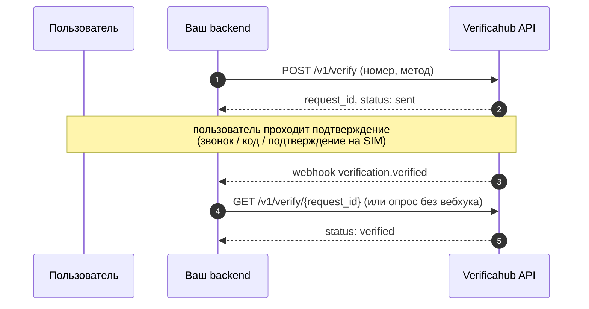

# Интеграция с Verificahub API

Этот раздел — руководство для разработчиков: как устроена интеграция, как работают потоки
подтверждения, вебхуки и что стоит учесть в проде. Полное описание каждого эндпоинта — в разделе
**Справочник API** (слева в меню), пошаговое первое подключение — в
[Быстром старте](../start/index.md).

## Модель интеграции

Verificahub API — **серверный (server-to-server) HTTP API**. Ваш бэкенд обращается к нам,
пользователь остаётся в вашем интерфейсе. Оплата — по модели pay-as-you-go: с предоплаченного
баланса списывается стоимость каждой оказанной услуги подтверждения.

- **Базовый URL:** `https://api.verificahub.ru`, все методы — под `/v1`.
- **Регион (v1):** Россия, номера в формате E.164 (`+7…`).
- **Валюта (v1):** `RUB`.
- **Формат:** JSON, поля в `snake_case`; ошибки — RFC-7807 с полем `error_code`.



## Аутентификация

Каждый запрос — **HTTP Basic**: имя пользователя — ваш `api_key`, пароль — `api_secret`
(оба выдаются в личном кабинете).

```bash
curl https://api.verificahub.ru/v1/balance -u "vh_live_a1b2…:vh_sec_9f8e…"
```

`api_secret` — это как пароль: храните его на сервере, никогда не встраивайте в браузер или мобильное
приложение. API строго server-to-server. Ключи можно ротировать в кабинете.

## Методы подтверждения

Все методы вызываются через один эндпоинт `POST /v1/verify` — меняется только поле `method`.

| `method` | Как подтверждается | Нужен ли код от пользователя |
| --- | --- | --- |
| `reverse_flash_call` | Пользователь звонит на выданный номер, подтверждаем по Caller ID | Нет |
| `telegram_otp` | Код приходит в Telegram, пользователь вводит его у вас | Да — через `/v1/verify/check` |
| `mts_id` | Оператор МТС «Мобильный ID» присылает подтверждение на SIM; при откате — код по SMS | Только при откате на SMS-OTP |

`telegram_otp` и `mts_id` доступны, если включены для вашего аккаунта. Актуальные цены по каждому
методу отдаёт `GET /v1/prices` — не зашивайте тарифы в код (см. [Лучшие практики](./best_practices.md)).

## Что дальше

- [Как работают потоки подтверждения](./flows.md) — диаграммы по каждому методу.
- [Вебхуки](./webhooks.md) — как получать статусы без опроса.
- [Лучшие практики](./best_practices.md) — опрос против вебхуков, идемпотентность, ошибки, лимиты.
