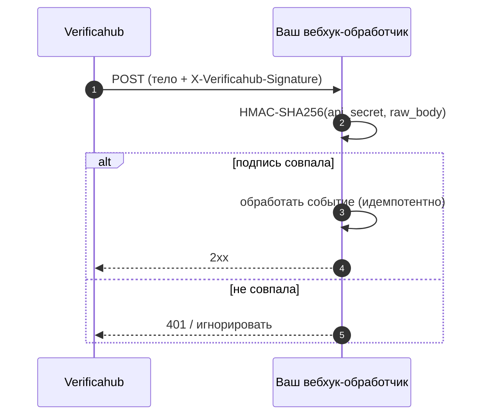

# Вебхуки

Если указать в аккаунте **URL для вебхуков**, мы будем присылать на него JSON-событие при каждом
изменении статуса — чтобы не опрашивать статус вручную.

## События

`verification.sent`, `verification.delivered`, `verification.code_required`, `verification.verified`,
`verification.expired`, `verification.failed`.

`verification.code_required` присылается **только для `mts_id`** — когда push откатился на SMS-OTP и от
пользователя теперь нужен код (см. [Потоки подтверждения](./flows.md)). Если push проходит без кода,
это событие не приходит: оно и есть ваш сигнал, что для конкретной проверки код всё-таки нужен.

## Формат

```json
{
  "event": "verification.verified",
  "request_id": "8f2c…",
  "phone_number": "+7999*****67",
  "method": "reverse_flash_call",
  "status": "verified",
  "timestamp": "2026-06-17T09:30:42Z"
}
```

`phone_number` — маскированный.

## Проверка подписи

Каждая доставка подписана HMAC по «сырому» телу запроса — так вы убеждаетесь, что событие от нас:

```
X-Verificahub-Signature: sha256=<hex HMAC-SHA256(api_secret, raw_body)>
```

Пересчитайте HMAC своим `api_secret` по неизменённому телу запроса и сравните значения (сравнение —
константное по времени) перед тем, как доверять событию.



## Доставка и идемпотентность

- Отвечайте `2xx` для подтверждения. На не-2xx мы повторяем доставку с задержками (`0s`, `5s`, `30s`).
- Доставка **as-least-once** — одно и то же событие может прийти несколько раз. Делайте обработку
  идемпотентной: дедуплицируйте по паре `(request_id, event)`.
- Если нужно сверить состояние — источник истины `GET /v1/verify/{request_id}`, а не вебхук.

Опрос статуса и лучшие практики надёжности — в разделе [Лучшие практики](./best_practices.md).
