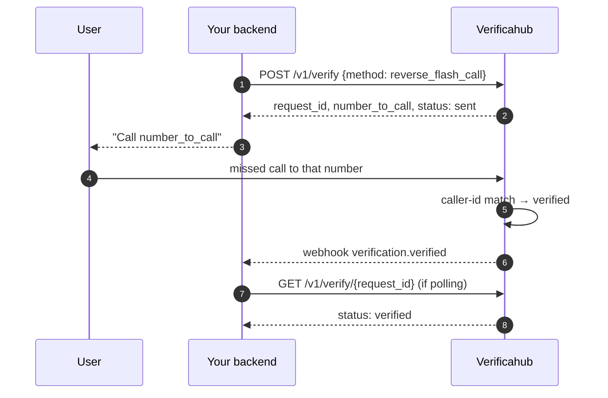
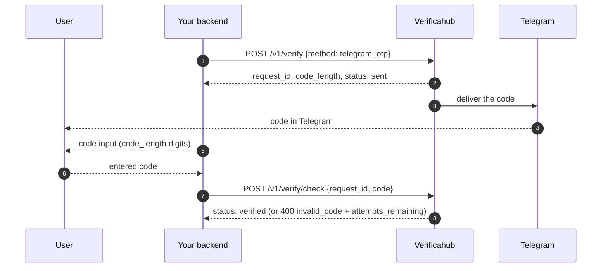
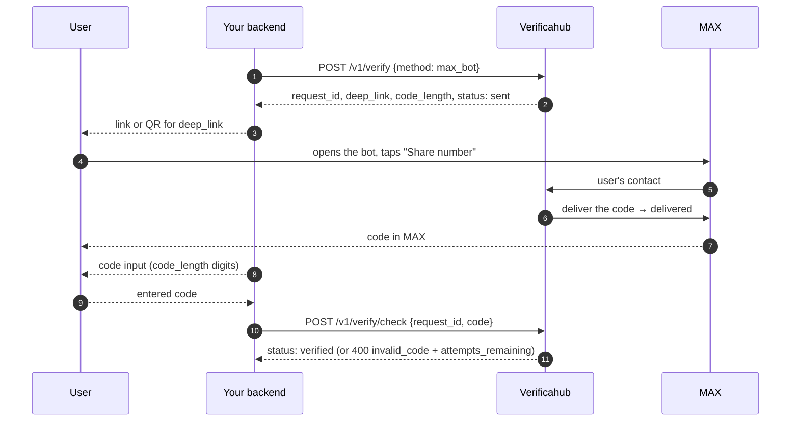
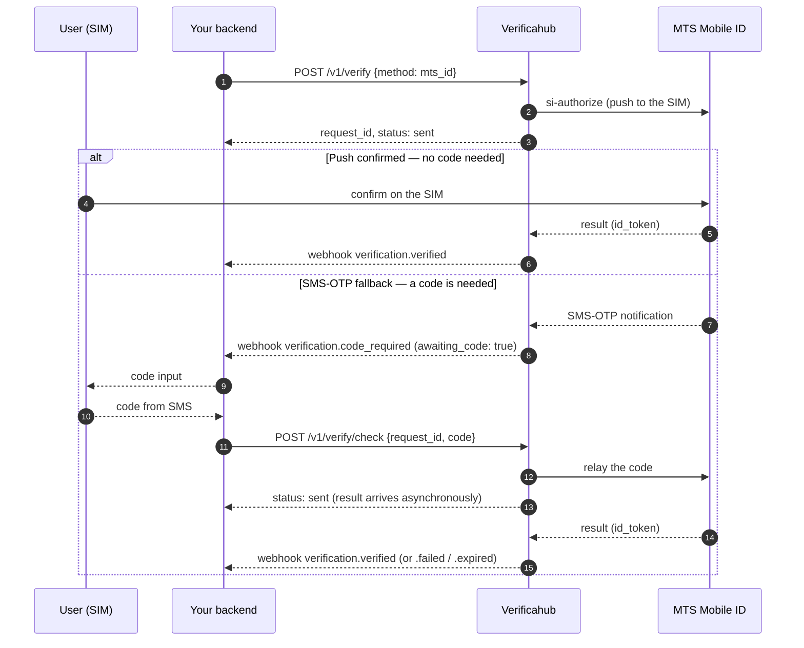

# How the verification flows work

Here's what happens at each step, from your backend's point of view. The overall shape is the same:
`POST /v1/verify` creates a session, and you learn the result either via a [webhook](./webhooks.md) or by
polling `GET /v1/verify/{request_id}`. Only the middle differs — how the user completes verification.

Session statuses: `sent` → `delivered` (optional) → `verified`, or `expired` (TTL elapsed) / `failed`
(terminal error).

## reverse_flash_call — no code typed

The user calls a number we hand out, and we verify by caller id. Nobody types a code.

Show the user `number_to_call` and wait for `verified` (by webhook or polling). No code is typed;
`/v1/verify/check` isn't used for this method.

## telegram_otp — a code from Telegram

We generate a code and deliver it in Telegram via the official bot; the user enters it in your UI and you
submit it for checking.

A wrong code returns `400 invalid_code` with `attempts_remaining`; once attempts run out the session
becomes `failed`.

## max_bot — a code in the MAX messenger

We generate a code and deliver it in the MAX messenger via our bot. The difference from Telegram: the
`POST /v1/verify` response carries a `deep_link` field (`https://max.ru/<bot>?start=<token>`); show it to
the user as a link or a QR code. The user opens the bot and taps **"Share number"** — and only then does
the code arrive in MAX. From there it's the usual flow: the user enters the code in your UI and you submit
it for checking.

The user must share the **same** number the verification was started for — otherwise no code is sent. The
code arrives in MAX only after the "Share number" step: before it the status is `sent`, after delivery it's
`delivered` (and `awaiting_code: true`). Billing is charge-on-delivery: if the user never opens the bot or
never shares their number, no charge is applied.

## sms and flash_call — same code entry, different channel

Both follow the same "code → `/v1/verify/check` → `verified`" shape as Telegram above:

- **`sms`** — the code is delivered to the user by SMS. `POST /v1/verify` returns `code_length` and
  `status: sent`; the user enters the code and you submit it to `POST /v1/verify/check`.
- **`flash_call`** — we place a dropped call to the user's number, and **the code is the trailing
  `code_length` digits of the incoming number**. The user reads them off the screen and enters them; then
  the same `/v1/verify/check` step.

## mts_id — operator-asserted (dual path)

The key trait: `mts_id` has **two paths**, and you don't know in advance which fires. Usually the operator
confirms right on the SIM — and no code is needed. But if the push can't complete (e.g. an MVNO number),
it **falls back to SMS-OTP**, and only then does the user get a code to enter.

So **don't show a code input up front**. Wait for the signal: the `verification.code_required` webhook or
the `awaiting_code: true` flag in the status. No signal → no code.

What matters for `mts_id`:

- **Poll `awaiting_code`** (or listen for `verification.code_required`) — show the code input only on that
  signal. Before it, `awaiting_code: false`.
- **`/v1/verify/check` is asynchronous.** We relay the code to the operator, and the final result arrives a
  moment later — so the `check` response is `status: sent`, not `verified`. Learn the outcome from
  `GET /v1/verify/{request_id}` or the `verification.verified` / `verification.failed` /
  `verification.expired` webhooks (an operator-consent timeout arrives as `expired`).
- **A code submitted too early** (before the fallback) returns `409 not_pending`.

## Learn the result: webhook or polling

Both work, and you can combine them (webhook as primary, polling as a safety net):

- **Webhook** — we push an event to your URL (see [Webhooks](./webhooks.md)).
- **Polling** — periodically request `GET /v1/verify/{request_id}` until a terminal status.

The source of truth on any mismatch is `GET /v1/verify/{request_id}`.
