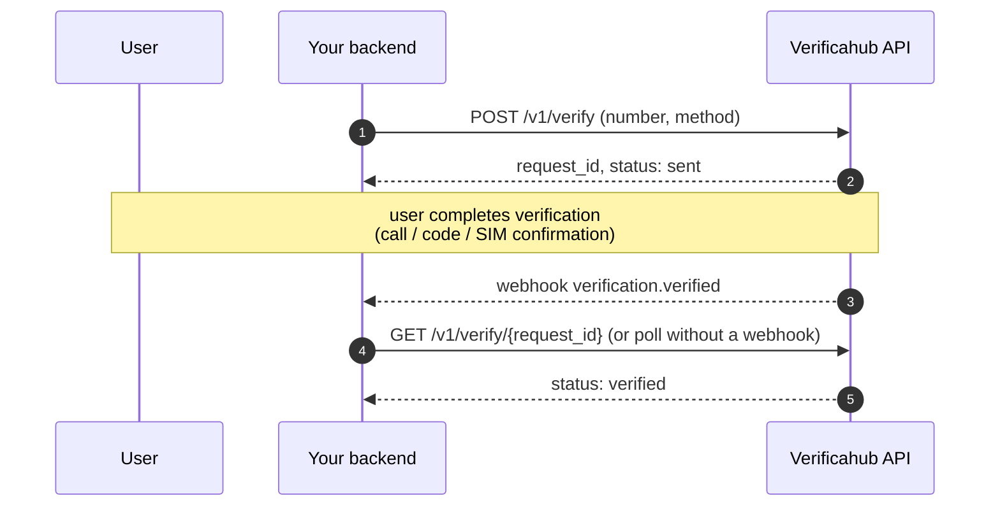

# Integrating with the Verificahub API

This section is the developer guide: how the integration is structured, how the verification flows work,
webhooks, and what to keep in mind in production. Every endpoint is described in the **API reference**
(left menu); a step-by-step first integration is in [Getting started](../start/index.md).

## Integration model

The Verificahub API is a **server-to-server HTTP API**. Your backend talks to us; the user stays in your
interface. Billing is pay-as-you-go: the cost of each rendered verification service is debited from your
prepaid balance.

- **Base URL:** `https://api.verificahub.ru`, everything is under `/v1`.
- **Region (v1):** Russia; numbers in E.164 (`+7…`).
- **Currency (v1):** `RUB`.
- **Format:** JSON, `snake_case` fields; errors are RFC-7807 with an `error_code`.



## Authentication

Every request uses **HTTP Basic**: the username is your `api_key`, the password is your `api_secret`
(both issued in the dashboard).

```bash
curl https://api.verificahub.ru/v1/balance -u "vh_live_a1b2…:vh_sec_9f8e…"
```

Treat `api_secret` like a password: keep it on your server, never embed it in a browser or mobile app.
The API is strictly server-to-server. Keys can be rotated in the dashboard.

## Verification methods

Every method is called through the single `POST /v1/verify` endpoint — only the `method` field changes.

| `method` | How it verifies | Does the user type a code? |
| --- | --- | --- |
| `reverse_flash_call` | The user calls a number we return; we verify by caller id | No |
| `telegram_otp` | A code is delivered in Telegram; the user enters it in your UI | Yes — via `/v1/verify/check` |
| `mts_id` | MTS Mobile ID pushes a confirmation to the SIM; on fallback, an SMS code | Only on the SMS-OTP fallback |

`telegram_otp` and `mts_id` are available if enabled for your account. Current per-method prices come from
`GET /v1/prices` — don't hardcode tariffs (see [Best practices](./best_practices.md)).

## Next

- [How the verification flows work](./flows.md) — a diagram per method.
- [Webhooks](./webhooks.md) — receive statuses without polling.
- [Best practices](./best_practices.md) — polling vs webhooks, idempotency, errors, limits.
