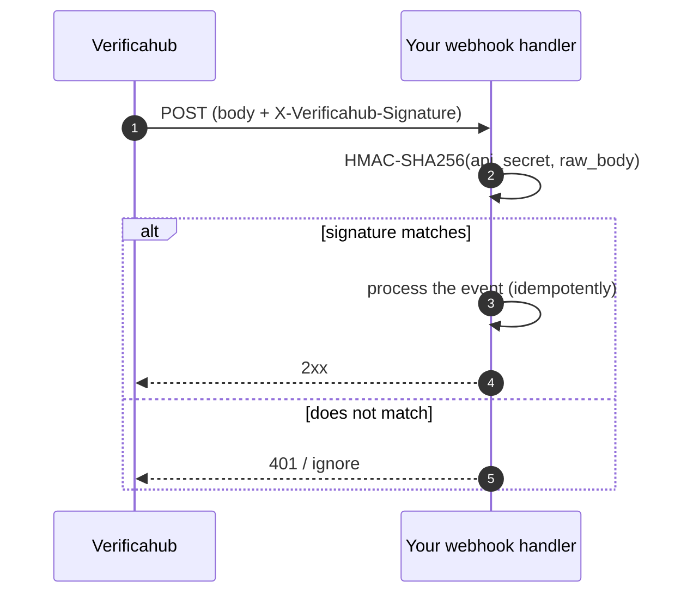

# Webhooks

If you set a **webhook URL** on your account, we POST a JSON event to it on every status change — so you
don't have to poll.

## Events

`verification.sent`, `verification.delivered`, `verification.code_required`, `verification.verified`,
`verification.expired`, `verification.failed`.

`verification.code_required` fires **only for `mts_id`** — when the push falls back to SMS-OTP and a code
is now needed from the user (see [Verification flows](./flows.md)). If the push completes without a code,
this event never arrives: it is your signal that this particular verification does need a code.

## Payload

```json
{
  "event": "verification.verified",
  "request_id": "8f2c…",
  "phone_number": "+7999*****67",
  "method": "reverse_flash_call",
  "status": "verified",
  "timestamp": "2026-06-17T09:30:42Z"
}
```

`phone_number` is masked.

## Verifying the signature

Every delivery is signed with an HMAC over the raw request body, so you can confirm it came from us:

```
X-Verificahub-Signature: sha256=<hex HMAC-SHA256(api_secret, raw_body)>
```

Recompute the HMAC with your `api_secret` over the unmodified request body and compare (constant-time)
before trusting the event.



## Delivery and idempotency

- Respond `2xx` to acknowledge. On a non-2xx we retry with backoff (`0s`, `5s`, `30s`).
- Delivery is **at-least-once** — the same event may arrive more than once. Make processing idempotent:
  dedupe on the `(request_id, event)` pair.
- To reconcile state, the source of truth is `GET /v1/verify/{request_id}`, not the webhook.

Polling and reliability best practices are in [Best practices](./best_practices.md).
